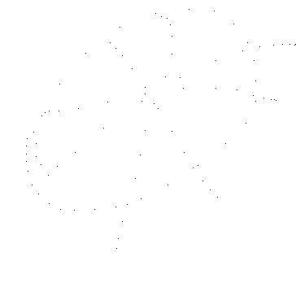
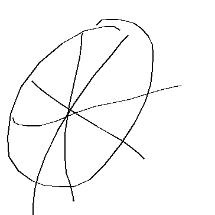
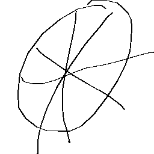

## Datenverarbeitung
Die Daten, die in diesem Projekt verwendet werden, kommen ausschließlich aus dem [Google Quickdraw Dataset](https://console.cloud.google.com/storage/browser/quickdraw_dataset/full/raw;tab=objects?prefix=&forceOnObjectsSortingFiltering=false).
Um die ersten Schritte der Verarbeitung zu vereinfachen, stellt Google [in einem Repository](https://github.com/googlecreativelab/quickdraw-dataset) einige Informationen zur Beschaffenheit der Daten bereit.
Zur Veranschaulichung soll hier beispielhaft das Datenset der `pizza.ndjson` betrachtet werden.

### Die rohen Daten
Die Datei mit den Rohdaten enthält zeilenweise Informationen über einzelne, von Menschen gezeichneten, Doodles.


Eine Zeile enthält dabei Folgende Informationen:

| Key          | Type                   | Description                                  |
| ------------ | -----------------------| -------------------------------------------- |
| key_id       | 64-bit unsigned integer| A unique identifier across all drawings.     |
| word         | string                 | Category the player was prompted to draw.    |
| recognized   | boolean                | Whether the word was recognized by the game. |
| timestamp    | datetime               | When the drawing was created.                |
| countrycode  | string                 | A two letter country code ([ISO 3166-1 alpha-2](https://en.wikipedia.org/wiki/ISO_3166-1_alpha-2)) of where the player was located. |
| drawing      | string                 | A JSON array representing the vector drawing | 

Ein Beispiel aus `pizza.ndjson`:
```json
{"word":"pizza","countrycode":"SA","timestamp":"2017-03-22 16:54:21.3692 UTC","recognized":true,"key_id":"6595531419680768","drawing":[[[203,193,177,143,104,66,34,17,12,14,30,53,75,100,125,152,177,204,228,245,255,258,259,258,251,239,228,211,199,190,180,171,163,163],[51,45,45,52,74,106,148,192,233,264,288,305,313,315,315,303,278,244,207,174,143,117,92,75,61,48,40,35,33,33,33,34,42,42],[0,27,45,58,78,94,111,127,143,161,177,194,210,228,244,261,277,294,310,328,344,361,380,397,413,429,449,463,481,496,512,529,546,566]],[[139,137,137,134,126,116,109,109,111,118,121,123,124,123],[56,61,73,97,133,179,226,266,292,312,325,334,340,338],[965,994,1011,1027,1043,1061,1081,1098,1115,1130,1148,1166,1194,1232]],[[21,23,31,45,67,95,128,161,191,220,252,273,294,306,306],[199,206,210,212,212,204,190,179,173,167,157,151,146,144,144],[1399,1443,1462,1477,1494,1510,1527,1543,1561,1580,1599,1614,1628,1642,1663]],[[216,205,188,158,125,96,75,63,58,56,55,55,55,56],[60,71,93,128,175,222,266,299,320,337,348,357,364,363],[2049,2093,2110,2126,2143,2162,2177,2195,2220,2230,2247,2261,2277,2362]],[[53,60,69,85,108,134,162,188,207,223,234,243,243],[136,143,151,163,179,195,212,227,238,250,259,268,268],[2535,2561,2577,2594,2611,2630,2644,2660,2676,2699,2715,2731,2749]]]}
```
An dieser Stelle können bereits die Informationen gefilter werden, die für unser Projekt relevant sind.
Zum einen ist das `"word": "pizza"` relevant, da es bei einer Klassifizierung die Ground Truth und somit das gewollte Ergebnis darstellt.
Weiterhin ist das Feld `"recognized": true` für uns wichtig, da wird zuerst nur mit Zeichnungen arbeiten wollen, die auch von Google korrekt identifiziert worden sind.
Ist `"recognized": false`, verwerfen wir das Datum.
Zum wichtigsten Feld des Datensatz zählt das `"drawing"`, also die Zeichnung selbst.
Eine Zeichnung ist in Form von einzelnen Strokes, also "Pinselstrichen", dargestellt.
Ein Stroke wird durch `x, y` Koordinaten und einer Zeit `t` dargestellt und hat die From
```json
"drawing": [ 
  [  // First stroke 
    [x0, x1, x2, x3, ...],
    [y0, y1, y2, y3, ...],
    [t0, t1, t2, t3, ...]
  ],
  [  // Second stroke
    [x0, x1, x2, x3, ...],
    [y0, y1, y2, y3, ...],
    [t0, t1, t2, t3, ...]
  ],
  ... // Additional strokes
]
```
Final wollen wir als Resultat unserer Datenverabreitung ein `256x256` Bild erhalten.
Dafür müssen aus den einzelnen Strokes die Pixel extrahiert werden, die von einem Stroke eingefärbt werden.
Da wir nur mit schwarz-weiß Bildern hantieren, können wir das Bild in einer `256x256` Matrix bestehend aus `0` und `1` darstellen.
Zunächst müssen aber die Strokes naher betrachtet werden.
Zunächst kann die zeitliche Dimension verworfen werden, da wir uns nicht dafür interessieren wann und wie schnell ein Stroke gezeichnet wurde.
Nun betrachten wir die `x, y` Koordinaten der Strokes.
Zunächst gehen wir das Plotting naiv an.
Betrachten wir die Strokes eines Bilds.
Von den Strokes axtrahieren wir die maximale `x`- bzw. `y`- Koordinate mit
```python
import numnpy as np
max_val = 0
for stroke in img:
  print(stroke)
  for i in range(len(stroke[0])):
    print(stroke[0][i], stroke[1][i])
    if stroke[0][i] > max_val:
      max_val = stroke[0][i]
    if stroke[1][i] > max_val:
      max_val = stroke[1][i]

print(max_val)
```
wobei `img` das Array des `"drawing"`-Felds der Rohdaten enthält.
Mit dieser Information erstellen wur nun eine `np.full((max_val, max_val), 1)` Matrix.
Für jeden Punkt, der von einem Stroke bemalt wird, setzen wir den enstrepchenden Wert der Matrix auf `0`.
```python
for stroke in img:
  for i in range(len(stroke[0])):
    mat[stroke[0][i] - 1, stroke[1][i] - 1] = 0
```
Um die Matrix graphisch darzustellen, können wir [`PyPng`](https://pypng.readthedocs.io/en/latest/ex.html#a-palette) verwenden:

```python
import png
mat = [[int(c) for c in row] for row in mat]
w = png.Writer(len(mat[0]), len(mat), greyscale=True, bitdepth=1)
f = open('image.png', 'wb')
w.write(f, mat)
f.close()
```
Das resultierende Bild sieht dann so aus:



Hier sehen bereits eines der Probleme: Die Strokes markieren nicht alle Punkte die tatsächlich eingefärbt werden müssen, sondern nur eine Teilmenge davon.
Um die Bilder also richtig anzeigen und die Daten richtig verarbeiten zu können, müssen wir also die Pixel zwischen den einzelnen Punkten füllen.
Dafür können wir die [Python Imaging Library](https://pillow.readthedocs.io/en/stable/) verwenden.
```python
from PIL import Image, ImageDraw

image = Image.new("RGB", (max, max), color=(255,255,255))
image_draw = ImageDraw.Draw(image)

for stroke in img:
  stroke_tup = [(stroke[0][i], stroke[1][i]) for i in range(len(stroke[0]))]
  image_draw.line(stroke_tup, fill=(0,0,0), width=2)

img_data = np.reshape(list(image.getdata()), (max_val, max_val, 3))


mat = np.full((max_val, max_val), 1)

for i, row in enumerate(img_data):
  for j, val in enumerate(row):
    if not np.array([v == 255 for v in val]).all():
      mat[i,j] = 0

mat = [[int(c) for c in row] for row in mat]
w = png.Writer(len(mat[0]), len(mat), greyscale=True, bitdepth=1)
f = open('better_pizza.png', 'wb')
w.write(f, mat)
f.close()
```



Jetzt sieht das schon viel besser aus

Das letzte Problem, welches uns jetzt noch im Wege steht, ist die Auflösung der Bilder.
Für unsere Verarbeitung wollen wir, dass alle Bilder eine Auflösung von `256x256` Pixeln haben.
Dafür skalieren wir die Bilder in den meisten Fällen runter.
Im Rahmen unserer Verarbeitung setzen wir direkt bei den Strokes an und berechnen diese neu, sodass alle `x, y` Werte zwischen 0 und 255 liegen:

```python
max_x, _, max_y, _, a = get_rescale_factors(strokes)

for stroke in strokes:
  stroke[0] = [x for x in np.rint(np.interp(stroke[0], (max_x - a, max_x), (0, 255))).tolist()]
  stroke[1] = [y for y in np.rint(np.interp(stroke[1], (max_y - a, max_y), (0, 255))).tolist()]
```

`get_rescale_factors` ist dabei eine Funktion, die uns die maximale `x, y` Koordinaten zurürckgibt, die für die Skalierung benötigt werden.
Um die Bilder auf das Nötigste zu begrenzen geben wir auch `a` zurück, welches die Seitenlänge eines Quadrats ist, die den relevanten Teil der Zeichnung perfekt eingrenzt.



Die dargestellten Schritte führen wir für alle von Google erkannten Bilder aus und speichern die neu skalierten und gefüllte Strokes in einer neuen Datei in der Form:
```json
{
"word": "pizza", 
"drawing": [[19, 19, 20, ...], [40, 41, 42, ...], ...]
}
```
wobei das Feld `"drawing"` auch hier wieder die Strokes in (fast) gleicher Form wie die Rohdaten darstellt:
```json
"drawing": [ 
  [  // First stroke 
    [x0, x1, x2, x3, ...],
    [y0, y1, y2, y3, ...]
  ],
  [  // Second stroke
    [x0, x1, x2, x3, ...],
    [y0, y1, y2, y3, ...]
  ],
  ... // Additional strokes
]
```
Beachte, dass die zeitliche Dimension entfallen ist.

